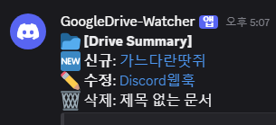

슬랙 쓰려고 했는데 가난한 개발자는 디스코드로 노선을 틀었다.  




> 근데 삭제 메시지는 잘 동작 안하더라. 정보 갱신이 느린건지 모르겠음. 

---

## 🚀 주요 기능
1. **업무 시간 필터링**: 주말 및 업무 외 시간(20시 이후 ~ 익일 10시 이전)에는 알림을 보내지 않습니다.
2. **상태별 구분**: 파일의 생성(🆕), 수정(✏️), 삭제(🗑️) 상태를 구분하여 메시지를 생성합니다.
3. **중복 알림 방지**: `PropertiesService`를 이용해 파일별 마지막 수정 시간을 저장, 동일한 수정 사항이 중복 알림으로 가지 않도록 설계했습니다.
4. **경량화**: 저장 데이터가 너무 커지지 않도록 최근 50개의 기록만 유지하는 관리 로직을 포함합니다.

---

## 🛠️ 전체 코드 (Google Apps Script)

GAS 에디터에 아래 코드를 복사하여 붙여넣으세요. `CONFIG` 객체의 `WEBHOOK_URL`은 본인의 디스코드 웹후크 주소로 변경해야 합니다.

```javascript
/**
 * [설정값]
 * WEBHOOK_URL: 디스코드 채널 설정 -> 연동 -> 웹후크 생성 후 복사한 URL
 */
const CONFIG = {
  WEBHOOK_URL: 'YOUR_DISCORD_WEBHOOK_URL'
};

function driveFullWatcher() {
  // 1. 근무 시간 확인 (평일 10:00 ~ 20:00)
  if (!isBusinessHours()) return;

  const props = PropertiesService.getScriptProperties();
  
  // 이전 실행에서 저장된 파일별 마지막 수정 기록 로드
  const historyStr = props.getProperty('FILE_HISTORY');
  let fileHistory = historyStr ? JSON.parse(historyStr) : {};
  
  // 마지막 체크 시점 (기록이 없으면 기본 10분 전부터 체크)
  const lastCheck = Number(props.getProperty('LAST_FULL_CHECK')) || (Date.now() - 600000);
  let latestUpdate = lastCheck;
  
  const lastCheckIso = new Date(lastCheck).toISOString().split('.')[0] + 'Z';
  let messages = [];

  // 2. 생성 및 수정 체크
  // 내 소유('me' in owners)이면서 휴지통에 있지 않은 최근 수정 파일 검색
  const files = DriveApp.searchFiles(`modifiedDate > '${lastCheckIso}' and trashed = false and 'me' in owners`);
  
  while (files.hasNext()) {
    const file = files.next();
    const fileId = file.getId();
    const currentUpdateTime = file.getLastUpdated().getTime();
    const isNew = file.getDateCreated().getTime() > lastCheck;

    // [핵심 로직] 이전에 기록된 수정 시간보다 더 최근일 때만 리스트에 추가
    const lastRecordedTime = fileHistory[fileId] || 0;
    
    if (currentUpdateTime > lastRecordedTime) {
      const statusIcon = isNew ? "🆕 신규" : "✏️ 수정";
      messages.push(`**${statusIcon}**: [${file.getName()}](${file.getUrl()})`);
      
      // 기록 업데이트
      fileHistory[fileId] = currentUpdateTime;
      if (currentUpdateTime > latestUpdate) latestUpdate = currentUpdateTime;
    }
  }

  // 3. 삭제 체크 (휴지통에 있는 파일 확인)
  const trashedFiles = DriveApp.getTrashedFiles();
  while (trashedFiles.hasNext()) {
    const file = trashedFiles.next();
    const updateTime = file.getLastUpdated().getTime();

    if (updateTime > lastCheck) {
      messages.push(`🗑️ 삭제: ${file.getName()}`);
      if (updateTime > latestUpdate) latestUpdate = updateTime;
    }
  }

  // 4. 결과 발송 및 상태 저장
  if (messages.length > 0) {
    const finalMessage = `📂 **[Drive Summary]**\n` + messages.join('\n');
    sendToDiscord(finalMessage);

    // 기록 관리: 데이터 비대화 방지를 위해 최근 50개 기록만 유지
    const historyKeys = Object.keys(fileHistory);
    if (historyKeys.length > 50) {
      const newHistory = {};
      // 가장 최근에 업데이트된 50개만 추출하여 재구성
      historyKeys.slice(-50).forEach(k => newHistory[k] = fileHistory[k]);
      fileHistory = newHistory;
    }

    props.setProperty('FILE_HISTORY', JSON.stringify(fileHistory));
    props.setProperty('LAST_FULL_CHECK', latestUpdate.toString());
  }
}

/**
 * 디스코드 웹후크 전송 함수
 */
function sendToDiscord(message) {
  console.log("🚀sendToDiscord");
  UrlFetchApp.fetch(CONFIG.WEBHOOK_URL, {
    method: 'post',
    contentType: 'application/json',
    payload: JSON.stringify({ content: message }),
    muteHttpExceptions: true
  });
}

/**
 * 근무 시간 체크 (월-금, 10:00~20:00)
 */
function isBusinessHours() {
  const now = new Date();
  const day = now.getDay();    // 0:일 ~ 6:토
  const hour = now.getHours(); // 0~23시

  if (day === 0 || day === 6) return false;
  if (hour < 10 || hour >= 20) return false;

  return true;
}
```
### 📂 특정 폴더만 감시하고 싶다면?

기본 코드는 `DriveApp.searchFiles()`를 사용하여 내 드라이브 전체의 변경 사항을 검색합니다. 하지만 특정 업무용 폴더 내의 파일만 추적하고 싶다면, 해당 폴더의 **ID**를 사용하여 범위를 좁힐 수 있습니다.

#### 코드 수정 방법

스크립트 내의 `files` 검색 부분을 다음과 같이 수정해 보세요.

```javascript
// 감시하고 싶은 폴더의 ID (폴더 URL의 마지막 부분)
const FOLDER_ID = '여기에_폴더_아이디를_입력하세요';

// 특정 폴더 내의 파일만 검색하도록 수정
const folder = DriveApp.getFolderById(FOLDER_ID);
const files = folder.searchFiles(`modifiedDate > '${lastCheckIso}' and trashed = false`);
```